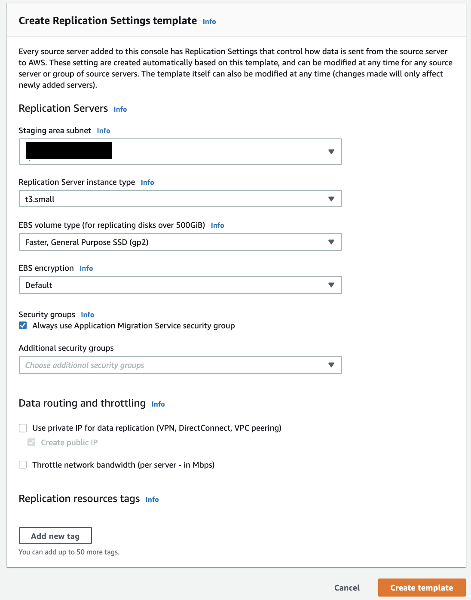
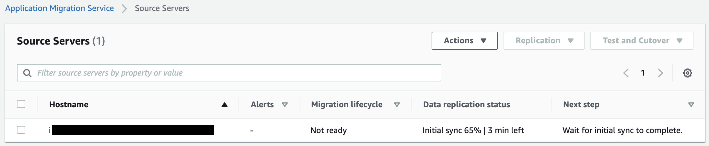
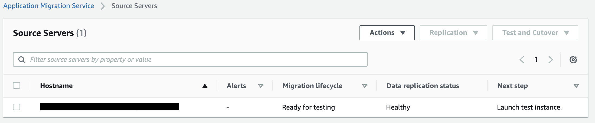
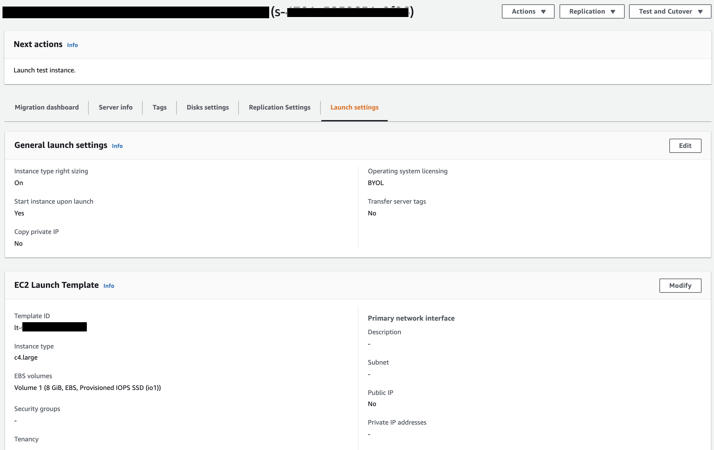

## AWS Application Migration Service

**Introduction**

- AWS Application Migration Service allows migrating the critical workloads to AWS avoiding any interference, or data leakage. With continuous block-level replication, automated machine conversion, and application stack orchestration, Application Migration Service simplifies the migration process and minimizes the chance for human error.

- Whether we are moving to AWS or across regions within AWS, Application Migration Service simplicity the needs and provides the security measures require to win in today’s fast-paced digital era

    

- Merits of Application Migration Service Live Migration include:

  - Cutover period of minutes and no data leakage
  
  - 100% data integrity for all applications (including databases and legacy applications)
  
  - Large-scale migrations with no performance degradation 
  
  - Wide platform and source Operating Systems support
  
  - Automated migration to reduce IT resources and project length

- How AWS Application Migration Service Works? 

    

- In this tutorial, we will focus on migrating a live machine using AWS Application Migration Service

    1. Traverse to the <a href="https://console.aws.amazon.com/mgn/">AWS Application Migration Service</a> and click on Get Started 

         
           
    2. Next we will create a Replication Settings template, Specify details, fill the following fields and choose to Create template
      
        - Staging area subnet

        - Replication Server instance type

        - EBS volume type

        - EBS encryption

        - Data routing and throttling limits
        
         

       Replication servers are lightweight EC2 instances that are used to replicate data between the source servers and AWS. They are automatically launched and terminated as needed. We can use data routing and throttling settings to control how data is routed from the source servers to the replication servers.

     3. After creating the template, we can add the source servers. To edit the template, in the left navigation pane, choose Settings. We can edit individual server replication settings after adding the source servers.
     
         
     
     4. Next we will add source servers to AWS Application Migration Service, install the AWS Application Migration Service Replication Agent on them. Download the agent installer with the wget command of the Linux source server. This wget command will download the Agent installer file - ``aws-replication-installer-init.py`` onto the server.
        
        The Agent installer follows the following format: 
        
        ``https://aws-application-migration-service-<region>.s3.amazonaws.com/latest/linux/aws-replication-installer-init.py``
        
        Replace <region> with the AWS Region into which we are replicating, and the following is an example of the full wget command for us-east-2:

        ``wget -O ./aws-replication-installer-init.py https://aws-application-migration-service-us-east-2.s3.amazonaws.com/latest/linux/aws-replication-installer-init.py``

        The command line will indicate when the installer has been successfully downloaded
  
         
  
     5. After the AWS Replication Agent is installed, the server will be added to AWS Application Migration Service console and undergo the initial sync process.​

         
  
     6. The Source Servers page displays a list of source servers. Each row in the list represents a single server. The migration lifecycle column shows the current state of each source server. After the initial sync process has been completed successfully, data replication will start automatically
  
         
  
     7. After we have added the source servers, we must configure the launch settings for each server. To access the launch settings, choose the host name of a source server and then navigate to the Launch settings tab
  
         

     8. After we have added the source servers and configured their launch settings, we must test the migration of the source servers to AWS before we initiate a cutover, to verify that the source servers function properly in the AWS environment. To launch a test or cutover instance for a single source server or multiple source servers, on the Source Servers page, select the checkbox for each server for which we want to launch a test instance
  
         
  
     9. When the test has started, the console will display a Launch job started message. To view the specific job for the test launch, choose View job details
  
        
  
    10. We should use the Migration dashboard tab to monitor the progress in relation to the migration lifecycle
  
        
     
    11. After we have finalized the testing of the source servers and ready for a cutover
    
        
    
        
    
    12. After the cutover action is performed, the server is considered migrated, and this will change the source servers’ migration lifecycle status to Cutover complete, indicating that the cutover is complete and that the migration has been performed successfully
        
        
    
        

**Note:** If we encounter any issues and want to launch new test or cutover instances, we can revert the test or cutover action. This will revert the source servers lifecycle status to the previous stage, indicating that these servers have not undergone cutover
